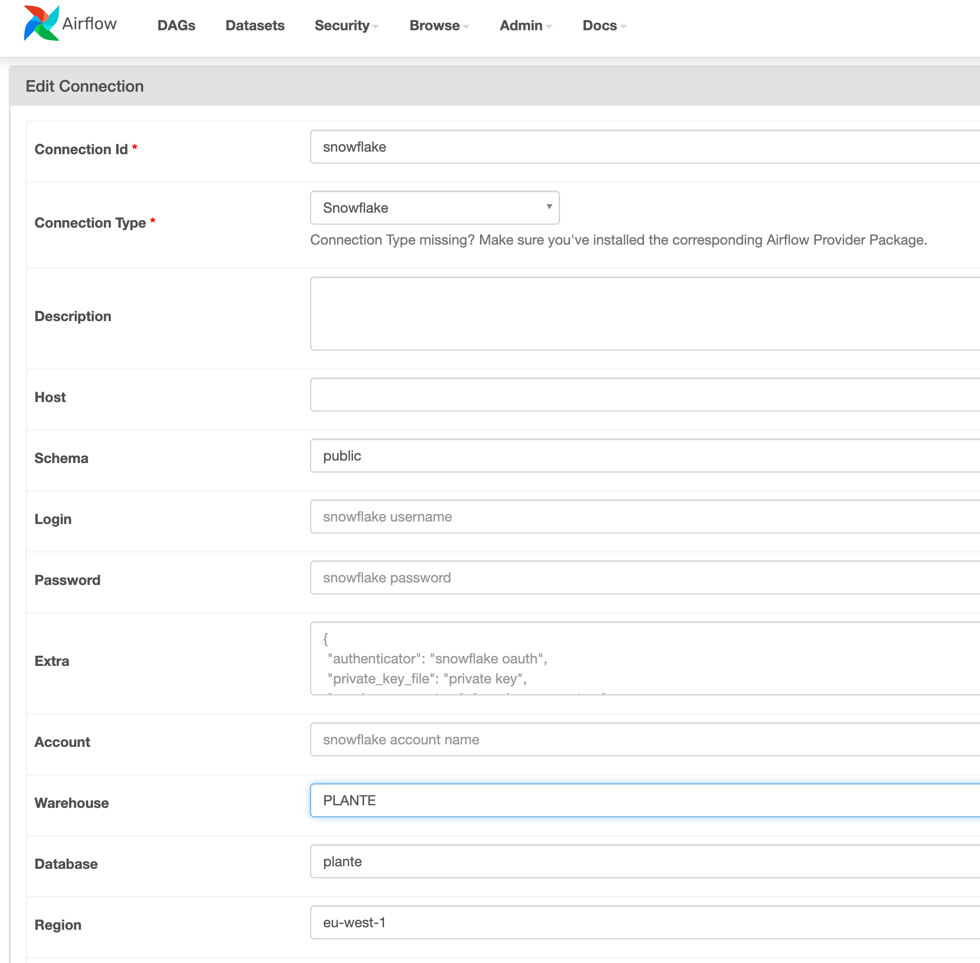
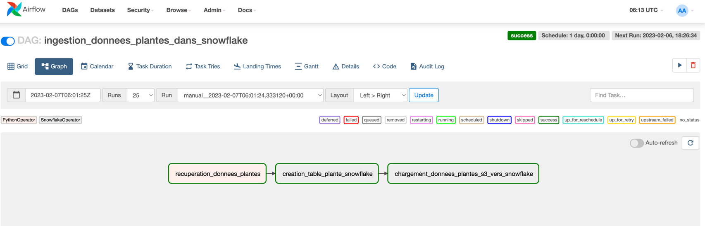
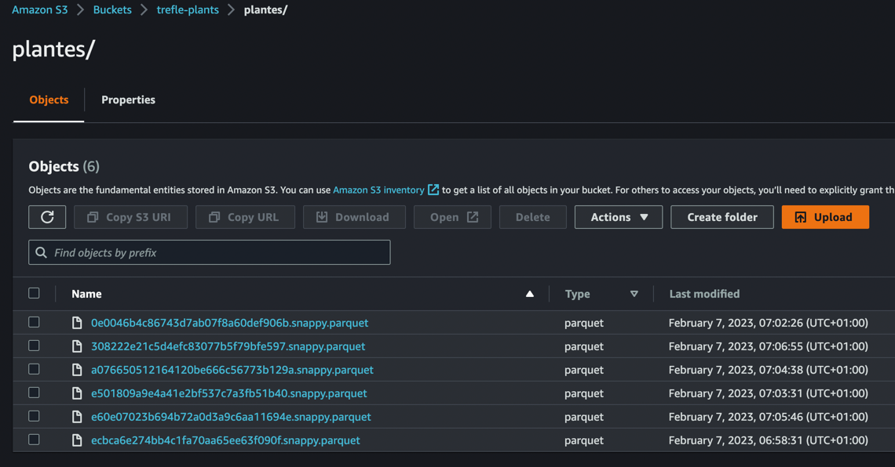
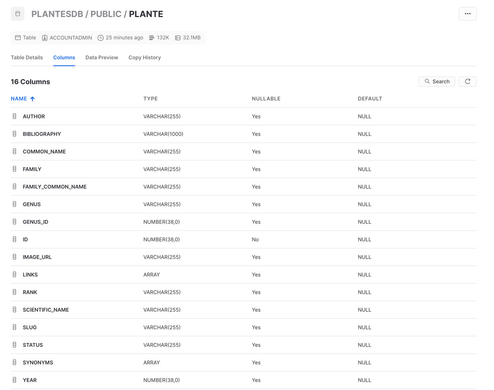
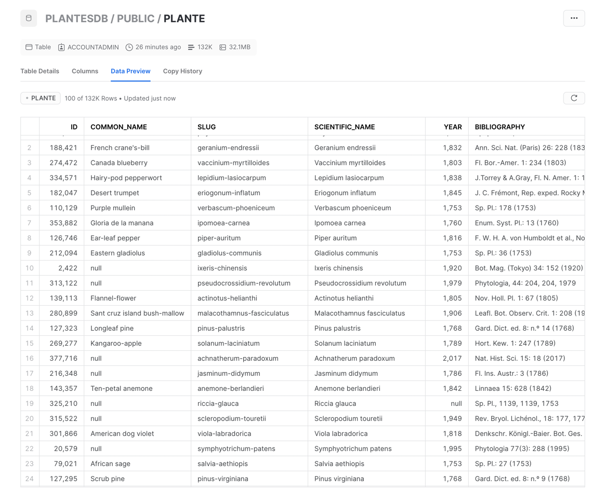

# Trefle test technique

## Prérequis :

+ Airflow : https://airflow.apache.org/docs/apache-airflow/stable/installation/installing-from-pypi.html
+ Python 3.10
+ Snowflake Free Trial : https://signup.snowflake.com/ 
+ Docker

## Configuration

1. Il faut construire une image Docker Airflow avec les dépendances python nécessaire :   
`make construire-image-airflow`
2. Lancer le docker compose, cette commande permettra de configurer et lancer Airflow :  
`make lancer-airflow`
3. Configurer les connexions sur Airflow : 
    + Créer une connexion avec aws :   
   
    + Créer une connexion avec snowflake :   
   
4. Lancer la DAG : `ingestion_donnees_plantes_dans_snowflake`  
   

## Workflow du DAG :

#### La première étape 

La **première étape consiste** à récupérer les données de plantes sur l'API Trefle.  
> On pourra retrouver le code concerné dans le dossier [src](./src), le code respecte plus ou moins `la clean archi`.

Cette étape récupère par pagination des listes de données et pour chaque élement, 
nous allons le tranformer en objet python Plante qui respectera un schema imposé. Cet objets python sera ensuite ajouter
au dataframe pandas. Au bout de 500 pages, nous enregistrons ce dataframe sous format 
parquet sur le stockage objet d'aws.   

#### La deuxième étape :

**Prérequis :**
+ Créer une database sur la console web de snowflake 🖐

La **deuxième étape consiste** à configurer Snowflake pour recevoir les données de plantes d'aws.
> Le code est principalement dans le fichier [creation_table_plante](dags/scripts-sql/creation_table_plante.sql)  

Ce code (sql) va permettre de créer : 
+ Un format de fichier pour le stage ici : `parquet`
+ Un stage avec les informations du bucket s3 qui sera utilisé pour la 3ème étape.
+ Une table Plante avec un schema qui correspond à celui de nos parquets

#### La troisième étape :

La **troisième étape consiste** à charger les données de s3 vers Snowflake. 
> Le code est dans le fichier [copier_donnees_s3_vers_snowflake](dags/scripts-sql/copier_donnees_s3_vers_snowflake.sql)

Le code (sql) permet de récuperer toutes les données dans les fichiers `.parquet` et les charger dans la table snowflake
`plante`.

#### Aller plus loin : 

+ Gérer les crédentials en local et sur nos environnements iso(prod) avec parameter store et en local avec un ansible vault : 
  + Pour le token de l'api 
  + Aws crédentials
+ Déployer le docker compose dans une machine Ec2 (avec terraform)
+ Automatiser la création de connexion Airflow pour snowflake ([terraform](https://registry.terraform.io/providers/DrFaust92/airflow/latest/docs/resources/airflow_connection))
+ Automatiser la création de la database snowflake ([terraform](https://registry.terraform.io/providers/Snowflake-Labs/snowflake/latest/docs/resources/database))

#### Utiles : 💡

+ Récupérer les infos sur le hostname :SELECT SYSTEM$ALLOWLIST()
+ Tester la connexion en local avec `snowcd`
+ Création stage doc snowflake : https://docs.snowflake.com/fr/user-guide/data-load-s3-create-stage.html
+ S3Hook pour récupérer les crédentials aws sur airflow pour les donner au code : https://hevodata.com/learn/airflow-s3-hook/